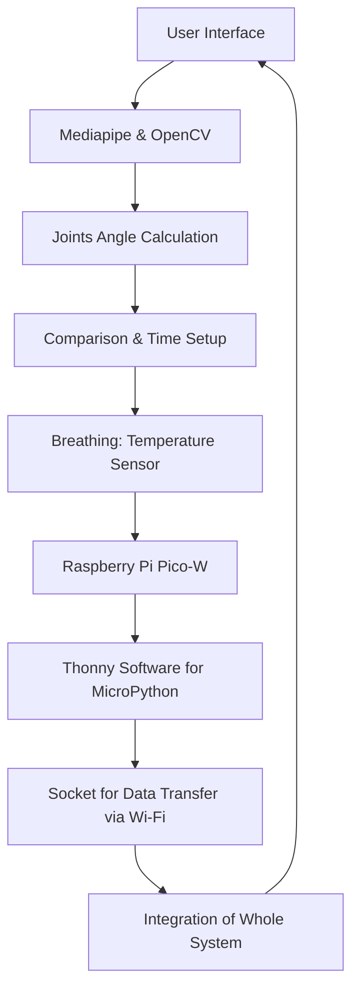

# Digital Yoga Master

## **Overview**

This folder contains the implementation of two key components:

1. **Digital Twin Yoga Master**
2. **Raspberry Pi Pico Breathing and Temperature Monitor**

## **Demo**


Below is an overview of the folder structure and the purpose of each code file.

---

### **Folder Contents**

1. **`digital_yoga_master_with_breathing.py`**
   - This Python script implements the **Digital Twin Yoga Master** system, which provides real-time yoga guidance using pose detection and feedback mechanisms.

2. **`digital_yoga_master_without_breathing.py`**
   - This Python script is a simplified version of the **Digital Twin Yoga Master** without breathing detection.

3. **`rpi_pico_code.py`**
   - This MicroPython script is designed for the **Raspberry Pi Pico** to measure temperature and detect breathing patterns, sending data to a server over Wi-Fi.

---

## **Digital Twin Yoga Master**

### **Description**

The **Digital Twin Yoga Master** is a Python-based application that leverages **pose detection**, **angle calculations**, and **real-time feedback** to provide personalized yoga guidance. This system uses a webcam to track body movements, evaluates yoga poses based on joint angles, and delivers visual and textual feedback to help users achieve optimal postures.

---

### **Features**

- **Pose Detection**: Utilizes **MediaPipe** for real-time body landmark detection and visualization.
- **Angle Calculations**: Computes joint angles to assess pose accuracy and alignment for specific yoga poses.
- **Step-by-Step Guidance**: Guides users through a predefined sequence of yoga poses, each evaluated for precision and duration.
- **Visual Feedback**: Displays arcs and annotations to highlight deviations from ideal postures.
- **Optional Audio Instructions**: Uses **gTTS** to provide vocal guidance for pose transitions.
- **Real-Time Timer**: Tracks the duration a user holds a correct posture to determine step completion.
- **Socket Communication**: Can send pose data to a server for additional analysis or storage. One can use **MQTT** or **COAP**.

---

### **Implementation**

#### **System Design**



#### **Code Implementation**

1. **Without Breathing Detection**
   - The system guides users through the **Triangle Pose** without considering breathing patterns.
   - Voice instructions are provided for each step.

2. **With Breathing Detection**
   - The system integrates breathing synchronization using a **server-client setup**.
   - Voice instructions are synchronized with breathing patterns (**Inhale/Exhale**).

---

### **Code Details**

1. **Pose Detection**:
   - Uses **MediaPipe** to identify body landmarks such as shoulders, elbows, and knees.
   - Calculates angles between joints using trigonometric functions to evaluate pose accuracy.

2. **Visual Feedback**:
   - Draws keypoints and angles on the webcam feed for real-time correction.
   - Uses **OpenCV** to render arcs and lines dynamically.

3. **Step Progression**:
   - Steps are defined in the code with specific pose requirements.
   - Timing thresholds ensure users hold poses correctly before advancing.

4. **Audio Feedback**:
   - Converts text-based instructions to speech using **gTTS**.
   - Audio is played to guide users through pose transitions.

---

### **Prerequisites**

- **Python 3.8 or higher**
- **Required Libraries**:
  - `opencv-python`
  - `mediapipe`
  - `numpy`
  - `gtts` (optional, for audio feedback)

---

### **Usage**

1. Clone the repository and navigate to the project directory.
2. Install dependencies using:
   ```bash
   pip install opencv-python mediapipe numpy gtts
   ```
3. Run the script:
   ```bash
   python digital_yoga_master.py
   ```
4. Follow on-screen instructions to perform yoga poses.
5. View feedback on the screen and listen to audio guidance if enabled.

---

## **Raspberry Pi Pico Breathing and Temperature Monitor**

### **Description**

This **MicroPython** script runs on a **Raspberry Pi Pico** to measure temperature using a **DS18B20 sensor** and detect breathing status. The data is sent to a remote server via **socket communication** for further analysis.

---

### **Features**

- **Wi-Fi Connectivity**: Connects the Raspberry Pi Pico to a Wi-Fi network for real-time data transmission.
- **Temperature Monitoring**: Reads temperature values from a **DS18B20 sensor** and processes them to detect trends.
- **Breathing Detection**: Uses temperature fluctuations to identify breathing phases (**Inhale**, **Exhale**, or **Hold**).
- **Server Communication**: Sends sensor data and breathing status to a server and receives acknowledgment.

---

### **Code Details**

1. **Wi-Fi Setup**:
   - Uses MicroPython's `network` module to connect to a Wi-Fi network.
   - Displays the device's IP address upon successful connection.

2. **Temperature Measurement**:
   - Interfaces with the **DS18B20 sensor** via GPIO pin using the `onewire` and `ds18x20` modules.
   - Reads temperature periodically and calculates differences to detect breathing phases.

3. **Breathing Analysis**:
   - Compares successive temperature readings:
     - An increase > **0.4°C** indicates an **exhale**.
     - A decrease > **0.35°C** indicates an **inhale**.
   - Stagnant temperatures suggest a **breath-holding phase**.

4. **Socket Communication**:
   - Sends formatted messages (temperature and status) to the server.
   - Receives and logs responses from the server.

---

### **Prerequisites**

- **Raspberry Pi Pico** with **MicroPython** installed.
- **Thonny** software for MicroPython coding.
- **DS18B20 sensor**.
- **Wi-Fi network details** (SSID and Password).
- **Required Python Libraries**:
  - `network`
  - `socket`
  - `machine`
  - `onewire`, `ds18x20`

---

### **Hardware Setup**

1. Connect the **DS18B20 sensor** to the Raspberry Pi Pico:
   - Data pin to **GPIO21**.
   - Power (VCC) and Ground (GND) as required.
2. Ensure a stable Wi-Fi network connection.

---

### **Usage**

1. Upload the script to the **Raspberry Pi Pico**.
2. Replace placeholders in the script:
   - Update `SSID` and `PASSWORD` with your Wi-Fi credentials.
   - Update `SERVER_IP` with the server's IP address.
3. Run the script on the **Raspberry Pi Pico**.
4. View temperature readings and breathing status updates in the terminal.
5. Server responses are printed in real-time.

---

### **Troubleshooting**

- Ensure the **DS18B20 sensor** is properly connected and detected.
- Verify the Wi-Fi credentials and server details.
- Monitor the console for error messages during execution.

---

### **Notes**

- Modify breathing thresholds (`0.35`, `0.4`) in the script as needed.
- Handle exceptions and ensure clean disconnection using the provided `try-finally` block.